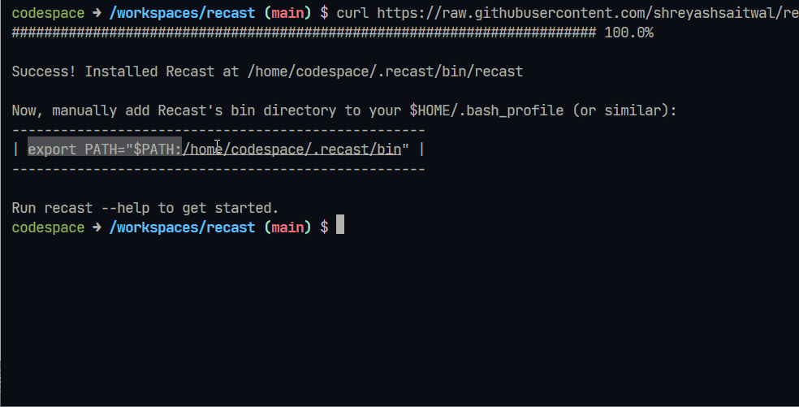

# Recast

Recast helps make your old extensions compatible with Kodular Creator version 1.5.0 or above.

## Prerequisites

To use Recast, you need to have Java Runtime Environment (JRE) installed on your system. To check if you have it
pre-installed, open your favorite terminal app and run the following:

```.sh
java -version
```

If you get an output similar to below, JRE is already available on your system.

```.sh
java version "1.8.0_281"
Java(TM) SE Runtime Environment (build 1.8.0_281-b09)
```

If you don't see an output similar to the above, you will need to install Java before installing Recast.

## Installing

Recast is a command-line tool, and therefore, you first need to install it on your computer to use it. As of now, Recast
can be installed on the following operating systems:

* Windows (64 bit)
* macOS (x86_64 arch)
* GNU/Linux (x86_64 arch)

### Using PowerShell (Windows)

1. Open PowerShell.
2. Copy and paste the following and hit enter:
    
   ```.ps1
    iwr https://raw.githubusercontent.com/shreyashsaitwal/recast/main/scripts/install.ps1 -useb | iex
    ```
3. Done! Run `recast --help` to verify installation.

### Using Shell (macOS and Linux)

1. Open your favorite shell (terminal).
2. Copy and paste the following and hit enter:
    
   ```.sh
    curl https://raw.githubusercontent.com/shreyashsaitwal/recast/main/scripts/install.sh -fsSL | sh
    ```
3. Once the download is complete, add Recast to your `PATH` by copying the export command from the output (as shown
   below) and running it:
   
    
4. Done! Run `recast --help` to verify installation.

## Usage

### Recasting extensions (AIX)

To make your old extension compatible with Kodular >1.5.0 using Recast, go through the following steps:

1. Navigate to the directory/folder where your extension is placed.
2. Open your favorite terminal in that directory.
3. Now, run the following:
    ```.sh
    recast --input you.extension.aix
    ```
   (Here, `your.extension.aix` is the name of your extension)
4. Bingo! A new, recasted extension with the name `your.extension.x.aix` is generated in the current working and ready
   to be used.

### Recasting AIAs

Starting with Recast v0.2.0, you get the ability to recast your AIA files as well. This reduces the manual work of
re-importing every recasted extension in your project.

1. Navigate to the directory/folder where your AIA is placed.
2. Open your favorite terminal in that directory.
3. Now, run the following:
    ```.sh
    recast --input you_app.aia
    ```
   (Here, `you_app.aia` is the name of your AIA file)
4. And there you go! All the extensions in your AIA are now recasted and can be found in the same directory with
   name `your_app_x.aia`.

> **Note:**
When you import a recasted AIA in Kodular (or AI2), your existing project isn't affected. Instead, a separate project with name `your_app_x` is created with all the existing work preserved.

## Tips

* You can recast multiple extensions/AIAs all at once by gathering them all in one directory and then running:
  ```.sh
  recast --input directory_path
  ```
  (Here, `directory_path` is the path to the directory where extensions/AIAs are stored.)

* If you want to output the recasted extension/AIAs in a separate directory, all you need to do is specify
  the `--output` option and pass the path to your desired directory.
    ```.sh
    recast --input you_aix_or_aia --output output_dir_path
    ```
  (Here, `output_dir_path` is the path to the output directory.)

## FAQ

1. Do I need to recast every extension to make it compatible with Kodular >1.5.0?<br>
   **Ans.** No, you don't need to. Only the extensions that started throwing errors after the latest update need to be
   recasted.

2. Why does Recast print **`No references to support libraries found`** when I try to recast my extension?<br>
   **Ans.** It means that your extension is already compatible with Kodular >1.5.0, and you don't need to recast it.
